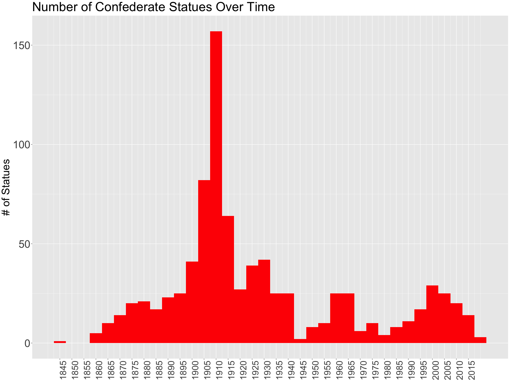

<!-- README.md is generated from README.Rmd. Please edit that file -->

# When were Confederate Statues made?

<!-- badges: start -->
<!-- badges: end -->

R Project for web scraping Wikipedia looking for dates when confederate
statues were erected

This is so wild. Let this sink in.

This was motivated by my recent trip to South Carolina and seeing my
first confederate statue. I am not sure why we glorify these people who
fought for people to be enslaved.

Check these out btw:

1.  <https://www.youtube.com/watch?v=dOkFXPblLpU&feature=emb_title>
2.  <https://www.youtube.com/watch?v=WClgR6Q0aPE>
3.  <https://www.theguardian.com/us-news/2017/aug/16/confederate-monuments-civil-war-history-trump>

((1)) is about how the United Daughters of the Confederacy brainwashed
the youth by pretending slavery wasn’t the cause of the Civil War

((2)) talks about the reason why each peek of confederate statues were
created

((3)) also talks about each peek and why these statues were created

<!-- -->

It’s just something to think about…

Also web scraping is fun

sources:  
<https://en.wikipedia.org/wiki/List_of_Confederate_monuments_and_memorials_in_Alabama>
<https://en.wikipedia.org/wiki/List_of_Confederate_monuments_and_memorials_in_Georgia>
<https://en.wikipedia.org/wiki/List_of_Confederate_monuments_and_memorials_in_Mississippi>
<https://en.wikipedia.org/wiki/List_of_Confederate_monuments_and_memorials_in_North_Carolina>
<https://en.wikipedia.org/wiki/List_of_Confederate_monuments_and_memorials_in_South_Carolina>
<https://en.wikipedia.org/wiki/List_of_Confederate_monuments_and_memorials>
